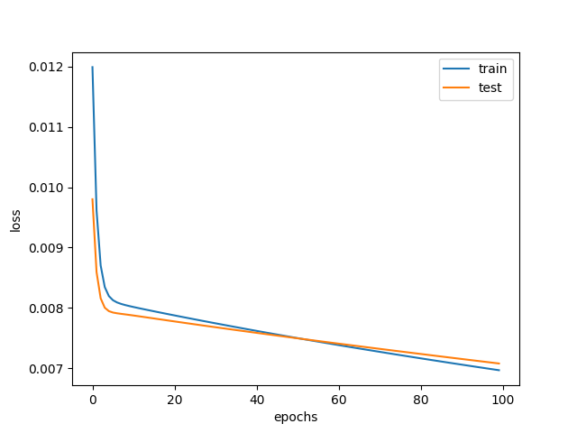

# Using Long Short Term Memory Networks (LSTM) to Evaluate the Pollution of Beijing, China.


## About LSTM

LSTM are a special kind of Recurrent Neural Network, capable of learning long-term dependencies. They were introduced by [Hochreiter & Schmidhuber (1997)](http://www.bioinf.jku.at/publications/older/2604.pdf), and were refined and popularized by many peoplo in following work [[Sundermeyer et al. (2012)](https://www.isca-speech.org/archive/interspeech_2012/i12_0194.html), [Zhou, Chunting, et al. (2015)](https://arxiv.org/abs/1511.08630), [Gensler, André, et al. (2016)](https://ieeexplore.ieee.org/abstract/document/7844673)].

All recurrent neural networks have the form of a chain of repeating modules of neural network. LSTM also have this chain like structure, bellow follow the module in an LSTM.

<p aling="center"></p> 
<h6 align="center">The repeating module in an LSTM containg four interacting layers.</h6>

To know more about lstm neural networks, please [click here](http://elgibborsms.com/blog/introduction-to-long-short-term-memory/).

1. Intall the following packages.
  ```

  ```
<p align="center"></p>
<h6 align="center">History of the model


#

<p align="center"><b>Sincerely:</b> <a href="https://github.com/neemiasbsilva">Neemias B. da Silva</a></p>

#